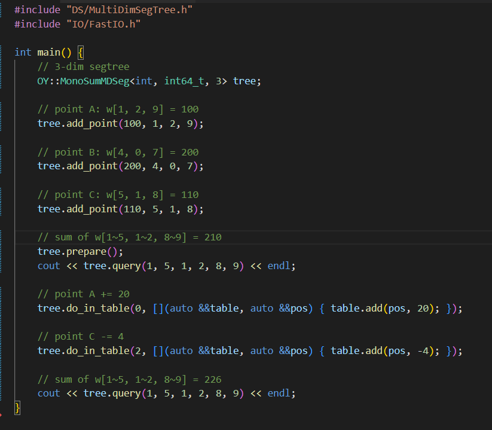

# CP-template

## 库简介

这是我个人的算法竞赛模板库。

大多数代码可以在 (gcc, C++11) ， (clang, C++11) 和 (msvc, C++14) 环境下编译运行。如有特殊情况会注明。

由于 C++17 的 std::gcd/std::lcm 以及 C++20 的位运算使用较多，所以本模板库内置了 std::bit.h 和 std_gcd_lcm.h 两个头文件。语言版本较低的使用者在导入这两个头文件之后，就可以使用 std::gcd/std::lcm/std::popcount 等。

## 库特点

1. 速度极快

   `RMQ` 问题是算法竞赛中常见的问题。如果带修，那么需要使用线段树来维护，以 $O(\log n)$ 的时间复杂度进行修改和查询。
   
   在 `atcoder` 运行 `benchmark` 显示，本模板库的 `OY::MonoMaxZkw<uint32_t>` 在 `n = 1e6` 的情况下，一秒钟可以做 `3.3e7` 次区间最值查询。惊人的速度。

2. 使用方便

   `FOR` 宏定义？ `i64` 缩写？编程老手都认识？ `No` ！本模板库中，不会使用这些花里胡哨的缩写，也不会假定使用者是老手。本模板，让任何码风的人都不会感到不适应。模板高度封装，使用的时候可以当成黑盒，而不需要对模板内部做手脚。

   每份代码都有对应的文档，提供使用范例； `TEST` 文件夹里，提供了本地运行代码，以及在若干 `oj` 题目上提交时的代码。

   
   
## 库特色

1. 大值域的线性空间线段树（ `CompressedTree` 维护 `0~1e18` 范围的权值线段树，空间复杂度正比于操作次数）

2. 动态大小的 `bitset` （ `DynamicBitset` 效率与静态大小的 `bitset` 持平）

3. 可以动态维护全局半群信息的双向队列（ `Deque` 完爆 `std::deque` ）

4. 可以维护区间加定值、区间加一次函数、区间加 `k` 次函数的树状数组 （ `KBIT` ）

5. 当只有邻项合并操作时，严格线性时间复杂度的并查集（ `LinearDSU` ）

6. 线性时间初始化， $O(1)$ 查询区间最值的状压 `RMQ` （ `MaskRMQ` ）

7. 支持区间翻转、区间剪切合并，同时维护区间半群信息的平衡树（ `MonoAVL` ， `MonoSplay` ）

8. 查询速度极快的单点修改、区间查询线段树（ `MonoZkw` ）

9. 二维、三维以及更高维度上，维护半群信息（可以带修）的多维表/树（ `MultiDimSegTree` ）

10. 通过编写 `node` 以实现自定义操作的势能线段树（ `SegmentBeat` ）

11. 支持区间排序，并维护区间半群信息的线段树/平衡树 （ `SortFHQ` ， `SortSeg`  ）

12. 线性时间初始化， 平均 $O(1)$ 查询区间半群信息的根树（ `SqrtTree` ）

13. 单点加修改、区间和查询速度极快，碾压树状数组的数据结构 （ `WTree` ）

14. 各种存储结构和算法执行器独立分开的图模板；

15. 动态/静态模数的、32位/64位模数的、使用/不使用蒙哥马利模乘的 `modint` ；

16. 运用了蒙哥马利模乘的运行极快的质数判定（ `PrimeCheck` ）

17. 运用了蒙哥马利模乘的运行极快的因数分解（ `Pollard Rho` ）

18. 支持基于范围遍历的数论分块 （ `SqrtDecomposition` ）

19. 支持自定义个数、种类的模数的序列哈希（ `SequenceHash` ， `SequenceMultiHash` ）

20. 支持回滚操作的 `KMP`，回文自动机；

21. 线性时间复杂度的后缀数组；

22. 通过编写 `node` 以实现自定义操作的动态树（ `GBT` ， `LCT`  ）

23. 结合其他模板，快速制造出各种树套树数据结构的控制器（ `LeveledBITManipulator` ， `LeveledZkwManipulator` ，`LeveledSegManipulator`）

24. 高度抽象的数位 `dp` 模板；

25. 线性空间同时维护最大值和最小值的堆（ `MinMaxHeap` ）；

26. 支持对交换幺半群进行子矩形修改、子矩形查询的二维线段树；

27. 实用的 `leetcode` 输入输出工具，支持网页端的同样格式的输入输出数据。

## FAQ

1. 我的编程环境非常老旧，看到你的模板库代码花里胡哨的，能运行起来吗？

   本模板库现已放宽对语言环境的要求，绝大多数模板， `gcc` 和 `clang` 在 `C++11` 之后均可使用； `MSVC` 在 `C++14` 之后均可使用（暂无 `C++11` 测试环境）。只要你的 `C++` 语言标准在 `C++11` 之后，均可以使用我的模板库。

2. 在 `LCT` 和 `GBT` 等一些模板里，看到 `MAX_NODE` 参数，这是什么意思？

   在这些模板里，通过 `MAX_NODE` 控制全局内存池的大小，，从这个全局内存池向不同的树对象分配结点。

3. 在模板里，填写的 `MAX_NODE` 是否越大越好？如果是多组测试，是否每组测试重新构造一个数据结构对象就会触发 $O(MAXNODE)$ 的初始化导致超时？

   以下回答针对你的结点类型为平凡类型的情况（无构造函数，无初始值）。

    `MAX_NODE` 相关联的是结点内存池的大小，所以并不会出现每次构造一个数据结构对象，就导致内存池初始化的情况。

    `MAX_NODE` 并非越大越好，当 `MAX_NODE` 过大时，编译可能会失败。只要编译能通过，那么在此范围内 `MAX_NODE` 多大都没关系，也不会有任何的时间开销。
   
4. 线段树只能有求和的功能吗？

   本模板库非常重视模板的泛化程度。
   
   一般来说，包括线段树在内的维护半群的数据结构，天然带有 `Min` ， `Max` ， `Gcd` ， `Lcm` ， `BitAnd` ， `BitOr` ， `BitXor` 以及 `Sum` 这八种实例类型。如果有额外的需求，可以通过 `make_` 系列来定义新的类型；或者传递自定义的 `Monoid` 半群类型。其他的容器也往往如此。

5. 线段树模板参数一大堆，填写起来老是报错？连类型名字都不能完整写出来该怎么办？

   为了防止定义各种千奇百怪运算符的使用者在使用模板时，因为无法描述出模板的完整类型名称而困扰，所以特意编写了 `make_` 系列函数。如同 `std::make_pair` 以及 `std::make_tuple` 一般，只需要填写少量参数即可创建出复杂类型的模板。例如， `make_SegTree` 可以用来创建线段树；只要打出 `make_SegTree` 之后跟随 `IDE` 的智能提示进行相应的填写即可。
   
6. 用 `make_SegTree` 可以创建一颗线段树；但是如果我要在 `std::vector` 里存放十颗线段树，我还是得把类型全称写出来，可是我写不出来，怎么办？

   既然用 `make_SegTree` 可以创建出一颗线段树，那么可以用 `using NickName = decltype(make_SegTree<...>(...));` 来捕获这棵树的类型，并给它起个别名。接下来即可用 `std::vector<NickName>` 的方式存储十颗线段树。
